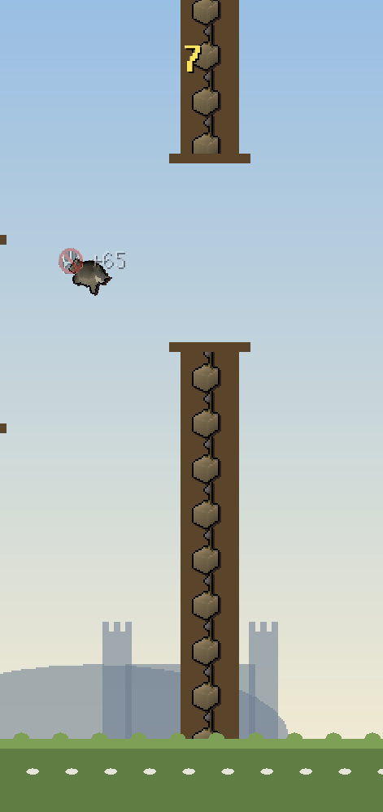
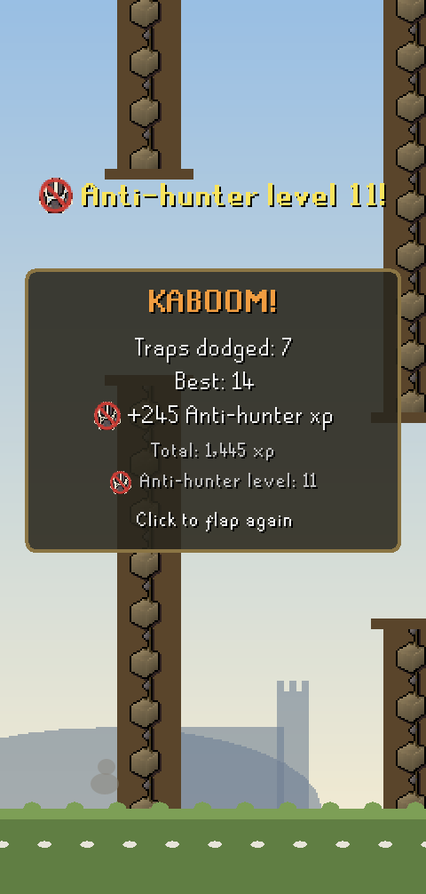
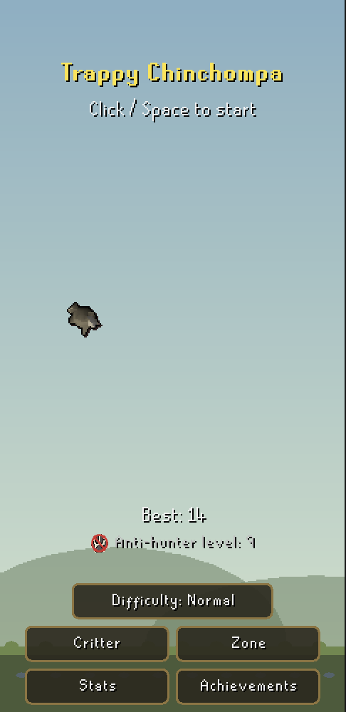

# Trappy Chinchompa

  

Level Old School RuneScape's newest skill: Anti-Hunter! As a chinchompa
escaping all those traps players keep laying, gain xp for every trap
you avoid - and enjoy the grind.

A flappy-style arcade game in your RuneLite sidebar. Touch a trap and
KABOOM.

## Features

- **One button** - click or Space to flap.
- **Anti-hunter xp** - the skill of not getting caught. Every trap pays more
  than the last (+5, +15, +25, ...), with optional in-game-style xp drops.
  Your lifetime total runs the real OSRS curve to an Anti-hunter level.
  99 is 13,034,431 xp. It can be done. It should not be done.
- **88 achievements** - score and level milestones, consistency streaks,
  one-offs (dying at exactly zero counts), and at least one secret.
- **Unlockables** - critters unlock by high score (grey 10 / red 20 / black
  40, then seven sealed ??????s); zones by level, Feldip Marsh at 1 to
  Prifddinas at 99. Unlocks announce the moment they land, mid-run included.
- **Real game sprites** - traps and most critters are item sprites loaded
  from your own client at runtime.
- **Three difficulties, honestly priced** - Easy pays x0.1 xp and never sets
  records; Hard pays x2.5. Difficulty locks when a run launches.
- **Polite by design** - the game only runs while its panel is the open
  sidebar tab; closed, it costs nothing.
- **Duel a friend** - `::duel <name> trappy` and you both play the same
  traps on the same seed: best round or average, over 1, 3 or 5 games.
  Each client replays the other's run to check the score, ties go to
  sudden death. Opt-in; see Duels below.

## Playing

Click the chinchompa icon in the sidebar, then click (or press Space) to
flap. The start screen holds the **Difficulty** toggle and the **Critter**,
**Zone**, **Stats**, and **Achievements** buttons - pickers show every
option's actual look, with locked rows greyed until earned.

## Configuration

| Option | What it does |
| --- | --- |
| Difficulty | Easy (x0.1 xp, no records) / Normal / Hard (x2.5 xp). |
| XP drops | Float +xp above the chin on every dodge. |

**Reset progress** (bottom of the Stats card) wipes progress only; the config
panel's standard **Reset** is the full factory reset.

## Duels

Turn on **Enable duels** in the plugin settings. While you are logged
in, the plugin keeps a connection to the AKAddons relay under your
display name so friends can find you. The duel dock sits under the game.

1. **Challenge.** Open the dock (`+ Duel a friend`), pick the player,
   difficulty, best round or average, and 1, 3 or 5 games, then Send.
   Or type `::duel testpurr trappy 3` in the chatbox (it never reaches
   the game), or right-click a name in the chatbox and pick **Duel**.
2. **Accept.** Their dock shows the challenge with Accept and Decline
   (also `::duel accept`, or right-click your name). Nothing starts.
3. **Play when you like.** The duel is now a line in both docks: "vs
   testpurr, play game 1 of 3, 4:52". Press Play, launch with a click or
   Space, play your game, then the next. Both of you see the identical
   traps. Every report, and every minute of play, pushes the duel's
   five-minute idle clock out; a side that goes quiet for five minutes
   forfeits, and if both do the duel is void.
4. **Verify.** Each client replays the other's run to check the score.
   When both sides are in, the relay settles: best round or average,
   sudden-death games on a tie. The line turns into the result, Details
   shows the per-game table, and one line goes to your own chatbox.

**Compete** (in the dock) queues you at your current difficulty for one
game against the next player who queues. Those games are scored the
same way, move your Elo rating, and only their opponent-verified scores
count for the **Top scores** board per difficulty. Your **Record** shows
duels won and lost, your head-to-head with each friend, your compete
record and ratings, and your last duels.

**Fair by construction.** The relay replays every run itself against the
same seed, so a score that its trace does not produce forfeits the duel;
no player's word is taken for a score, their own or their opponent's.
Seeds are revealed one game at a time when you press Play, and a run
cannot be reported faster than it could have been played. Your display
name is bound to your account the first time you connect, so nobody can
duel as you. Compete never pairs you with the same account, the same
machine, or someone you met in the last hour; repeat opponents earn
less rating each time and nobody gains more than 100 rating a day.

**What the relay keeps.** Your display name, a hash of your RuneLite
account id (hashed before it leaves your client and keyed again by the
relay, so the name stays yours and the id itself is never sent), the duels you
play (scores and runs, kept a day), your results, ratings and last 20
duels, and, like any server, the address you connect from (a few recent
ones, seen by the operator only, so compete never pairs one machine
with itself). Nothing else is sent: not your bank, your world, or other
players. **Hide me from top scores** keeps your name off the boards;
**Block challenges from** declines named players silently; duels are off
until you turn them on, and the operator will erase a player on
request. The relay's code is at github.com/AKAddons/akaddons-relay.
Developer toggles (invincibility, unlock-all) block duels. A client
started in RuneLite's developer mode can duel and compete with another
dev client on the same machine, and nothing it plays counts for ratings
or the board.

## Development

- `./gradlew run` - dev client with the plugin sideloaded. In
  `--developer-mode` only: 5x-tap **Stats** toggles all unlocks, 5x-tap
  **Zone** toggles trap invincibility - both watermarked DEBUG MODE,
  sandboxed, and branded on anything earned.
- `scripts/run_clients.sh 1` - a dev client without holding Gradle's lock,
  so a second one can start after switching the Jagex account.
- `./gradlew test` - headless game-model and duel tests.
- `docs/DUEL_PROTOCOL.md` - the portable duel spec (transport / session /
  game adapter), `docs/decisions/0001` the architecture decision.
- `./gradlew preSubmit` - tests + Plugin Hub token and glyph gates.
- `python3 scripts/generate_icons.py` - regenerates the original icon art.
  No Jagex assets are bundled; sprites load at runtime via ItemManager.
